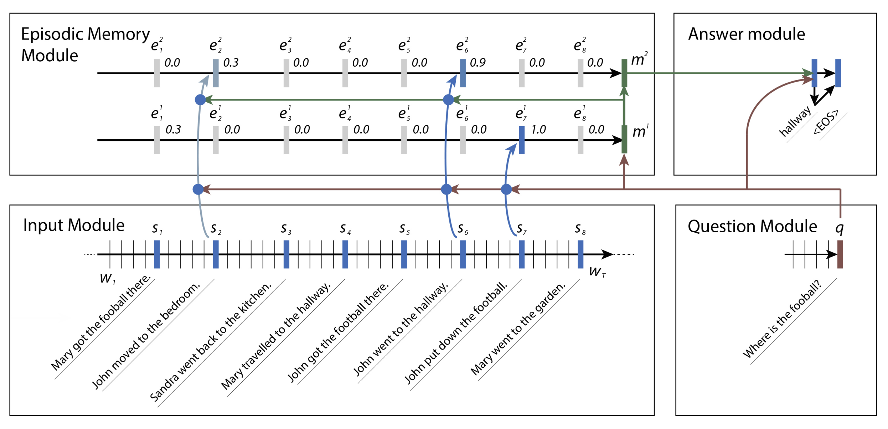

# Dynamic-Memory-Network
Python-pytorch Implementation of a dynamic memory network for a question answering system.

### Introduction
This Question Answering System is based on the paper "Ask Me Anything: Dynamic Memory Networks for Natural Language Processing" (	arXiv:1506.07285). The networks recieves facts as text input along with a question. The neural network architecture processes input facts and questions and forms episodic memories triggering an iterative attention process to form episodic memories and generate relevant answers.

### Prerequisites
* **Pytorch** ([instructions](https://pytorch.org/))
* **NumPy** ([instructions](https://scipy.org/install.html))
* **OpenCV** ([instructions](https://pypi.python.org/pypi/opencv-python))
* **Natural Language Toolkit (NLTK)** ([instructions](http://www.nltk.org/install.html))
* **Pandas** ([instructions](https://scipy.org/install.html))
* **Matplotlib** ([instructions](https://scipy.org/install.html))

### Dataset
Download the bAbI tasks (tasks_1-20_v1-2.tar.gz) from https://research.facebook.com/research/babi/.  
The data preparation code can be found in the [Data_prep.py](./Data_prep.py)

### Model Architecture 
The model consists of 4 modules as shown in the diagram below.

The model architecture implemnted in pytorch can be found in the [model.py](./model.py)
### Results
